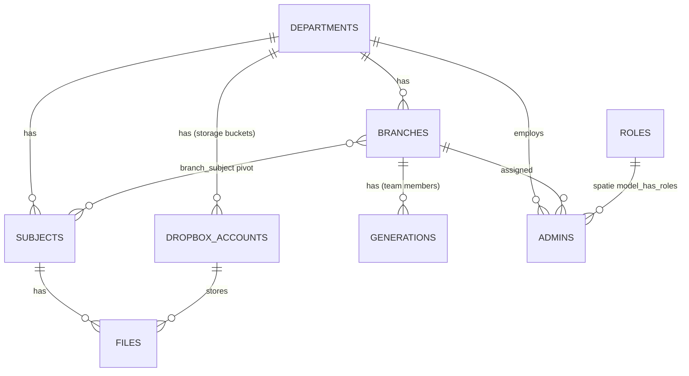

# 03 — Database

MySQL database. All schema is created by migrations in `database/migrations/`.

## Migration List

| Migration file | Creates |
|----------------|---------|
| `2014_10_12_000000_create_users_table.php` | `users` (default Laravel web users) |
| `2014_10_12_100000_create_password_resets_table.php` | `password_resets` |
| `2014_10_12_100000_create_password_reset_tokens_table.php` | `password_reset_tokens` |
| `2019_08_19_000000_create_failed_jobs_table.php` | `failed_jobs` |
| `2019_12_14_000001_create_personal_access_tokens_table.php` | `personal_access_tokens` (Sanctum) |
| `2024_10_18_152836_create_departments_table.php` | `departments` |
| `2024_10_18_152838_create_branches_table.php` | `branches` (FK → departments, `set null` on delete) |
| `2024_10_18_153435_create_generations_table.php` | `generations` (team members, FK → branches) |
| `2024_10_19_205223_create_subjects_table.php` | `subjects` (FK → departments) |
| `2024_10_23_223220_create_branch_subject_table.php` | `branch_subject` pivot (cascade FKs) |
| `2024_11_06_225643_create_dropbox_accounts_table.php` | `dropbox_accounts` (FK → departments) |
| `2024_11_27_112214_create_files_table.php` | `files` (FK → subjects, dropbox_accounts, cascade) |
| `2025_02_06_061335_create_admins_table.php` | `admins` (FKs → departments/branches, `restrict` on delete) |
| `2025_02_08_015335_create_permission_tables.php` | Spatie tables: `roles`, `permissions`, `model_has_permissions`, `model_has_roles`, `role_has_permissions` |
| `2026_09_11_000000_fix_dropbox_accounts_token_columns.php` | `dropbox_accounts`: `access_token` VARCHAR(255) → TEXT (Dropbox `sl.u.` tokens are ~1500–2000 chars; the old column made every save fail with MySQL 1406 and left `access_token` NULL), creates missing `token_expires_at` (guarded with `hasColumn`) |

## Domain Tables

### `departments`
| Column | Type | Notes |
|--------|------|-------|
| id | BIGINT PK | |
| name | VARCHAR | e.g. Mathematics, Physics, Chemistry, Geology, Botany, Animals |
| created_at / updated_at | TIMESTAMP | |

### `branches`
| Column | Type | Notes |
|--------|------|-------|
| id | BIGINT PK | |
| name | VARCHAR | e.g. Computer Science, Physics and Electronics |
| department_id | BIGINT FK → departments.id | nullable, `set null` on delete, cascade on update |
| timestamps | | |

### `generations` (team members, powers "About" pages)
| Column | Type | Notes |
|--------|------|-------|
| id | BIGINT PK | |
| name | VARCHAR | member name |
| year_joined | INT | e.g. 2020–2030 (seeded) |
| patch | INT | patch/batch number |
| branch_id | BIGINT FK → branches.id | nullable, `set null` on delete |
| image | VARCHAR | default `person_icon.png` |
| publish | BOOLEAN | default false — shown on public home when true |
| role | VARCHAR | OC / IT / HR / BR (seeded) |
| timestamps | | |

### `subjects`
| Column | Type | Notes |
|--------|------|-------|
| id | BIGINT PK | |
| name | TEXT | subject name (Arabic) |
| description | TEXT | nullable |
| code | TEXT | subject code e.g. `105ف`, `458رك` |
| department_id | BIGINT FK → departments.id | nullable, `set null` |
| timestamps | | |

### `branch_subject` (pivot — many-to-many)
| Column | Type | Notes |
|--------|------|-------|
| id | BIGINT PK | |
| branch_id | FK → branches.id | cascade delete/update |
| subject_id | FK → subjects.id | cascade delete/update |
| timestamps | | |

### `dropbox_accounts` (storage buckets)
| Column | Type | Notes |
|--------|------|-------|
| id | BIGINT PK | |
| email | VARCHAR | Dropbox account email |
| client_id | VARCHAR UNIQUE | Dropbox app key |
| client_secret | VARCHAR UNIQUE | Dropbox app secret |
| access_token | TEXT | nullable — short-lived (~1500–2000 chars), refreshed automatically; saved at setup time and by every refresh |
| refresh_token | TEXT | long-lived OAuth refresh token |
| department_id | BIGINT FK → departments.id | nullable |
| remaining_storage | BIGINT | default 2147483648 (2 GB) |
| token_expires_at | TIMESTAMP | nullable — token expiry, set at setup and on every refresh |
| timestamps | | |

> Note: `access_token` must stay TEXT — never shrink it back to VARCHAR or saves will fail silently (logged as MySQL 1406).

### `files` (metadata only — bytes live in Dropbox)
| Column | Type | Notes |
|--------|------|-------|
| id | BIGINT PK | |
| name | VARCHAR | file name |
| path | VARCHAR | Dropbox path (used to build the folder tree on the site) |
| link | VARCHAR | nullable — shared link |
| file_id | VARCHAR | nullable — Dropbox shared-link id (`scl/fi/{file_id}`) |
| rlkey | VARCHAR | nullable — shared-link security key |
| size | BIGINT UNSIGNED | bytes |
| subject_id | FK → subjects.id | cascade |
| dropbox_account_id | FK → dropbox_accounts.id | cascade |
| timestamps | | |

### `admins`
| Column | Type | Notes |
|--------|------|-------|
| id | BIGINT PK | |
| name / email (unique) / password | VARCHAR | |
| department_id | FK → departments.id | `restrict` on delete |
| branch_id | FK → branches.id | `restrict` on delete |
| role | VARCHAR | default `admin` (denormalized role name; Spatie `model_has_roles` is authoritative) |
| timestamps | | |

## Framework Tables
`users` (id, name, email unique, email_verified_at, password, remember_token, timestamps) · `password_reset_tokens` · `password_resets` · `failed_jobs` · `personal_access_tokens` · Spatie permission tables (polymorphic `model_type`/`model_id` linking Admins to roles/permissions).

## ER Diagram (Mermaid)

## Seeders

| Seeder | What it inserts |
|--------|-----------------|
| `DatabaseSeeder` | 6 departments, 18 branches, generations for years 2020–2030 (10 per year, fake names, roles OC/IT/HR/BR), calls `SubjectSeeder`, `RolesAndPermissionsSeeder`, creates default admin `admin@admin.com` / `#bom123456` (super admin), calls `BranchSubjectSeeder` |
| `SubjectSeeder` | ~200 real subjects with Arabic names + codes mapped to department ids |
| `BranchSubjectSeeder` | Attaches branch ids to each subject in the pivot |
| `RolesAndPermissionsSeeder` | 7 permissions (upload files, delete files, add/delete/edit admins, add/delete roles) + 3 roles: **super admin** (all), **admin** (upload/delete files, add admins), **editor** (upload/delete files) — all with guard `admin` |

## Known Gaps / Gotchas

- ~~`DropboxService` reads/writes `token_expires_at` on `dropbox_accounts`, but the migration does **not** define that column~~ **Fixed 2026-09-11:** migration `2026_09_11_000000_fix_dropbox_accounts_token_columns.php` creates it (and widens `access_token` to TEXT). The column previously existed only on manually-patched live DBs, which is also why token saves were failing.
- `files.file_id`/`rlkey` are nullable in the schema but validated as required in `storeFileDetails()` — the upload JS must always send them.

